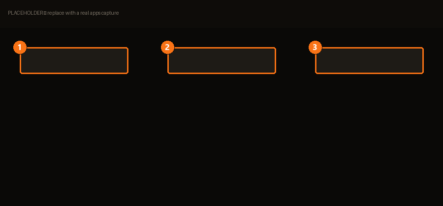

# App Catalog

> Browse & install apps in one click.

The tools *around* modding — the ones you'd otherwise hunt down on five different sites.

| | | |
|---|---|---|
| **1** | **Catalog** | What's available. |
| **2** | **Install** | One click. |
| **3** | **Sources** | Where the catalog comes from. |

## Adding a source

> Add raw JSON URLs of community catalogs.

A catalog is just a JSON file someone hosts. The official one can auto-import community
catalogs, so you often don't need to add anything by hand.

## Making your own

> Build a `catalog.json` you can host on GitHub and share with others.

If you maintain a set of tools for a game or a community, this is how you hand them over as
one list instead of ten links.

## Several executables in one app

BMM asks rather than guessing:

> This app contains several executables. Pick the one to launch, or keep BMM's auto-detection.

Pick explicitly when an app ships a launcher *and* the real binary — auto-detection is right
most of the time, not all of it.
