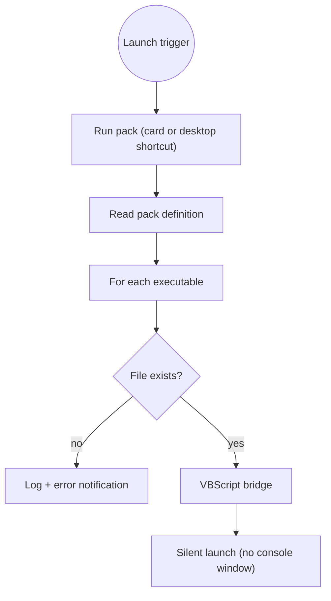

# Launch packs

A **launch pack** is a named group of **applications** started together in one click — your
game plus the companion tools you always open with it (a voice app, a tracker, a head-tracking
tool…).

## Creating one

In **Settings**, create a pack, name it, then add executables (`.exe`, `.bat`, `.ps1`, `.cmd`,
`.lnk`) two ways:

- the plain **file picker**, or
- the built-in **app picker**, which lists your installed programs Steam-style (it reads the
  Windows registry's installed-apps entries and your Start-Menu shortcuts, icons included).

Add a custom icon if you like — it's converted to a proper `.ico`.

## Running it

- **From the card** in Settings — every app starts **silently**: no console windows flashing.
- **From the desktop** — each pack also gets its own generated **shortcut**, so you can launch
  the whole group without opening BMM.

Under the hood, creating a pack generates a tiny `launcher.vbs` that starts each executable
invisibly, and a `.lnk` shortcut pointing at it:

!!! tip "Edit any time"

    Editing a pack regenerates its launcher and shortcut in place — the desktop shortcut keeps
    working. Deleting a pack removes its folder and shortcut cleanly.
