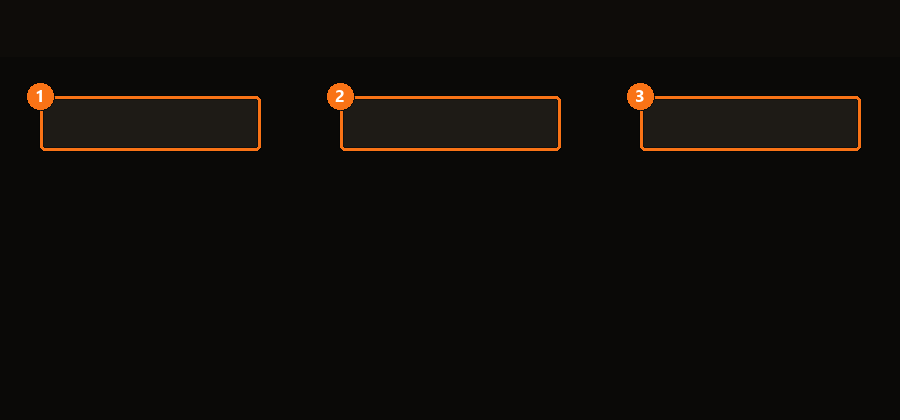

# Bibliothèque

La **Bibliothèque**, c'est là que vit chacun de tes mods — installé ou non, quelle que soit
sa provenance. Si tu ne devais apprendre qu'un seul écran de BMM, prends celui-là : tout le
reste (profils, modpacks, listes) n'est qu'une façon différente d'organiser ce qu'elle
contient.

| | | |
|---|---|---|
| **1** | **Recherche** | Filtre à la frappe, sur les noms, les auteurs et les tags. |
| **2** | **Filtres** | Restreint par jeu, catégorie ou état d'installation. |
| **3** | **Installer** | Ajoute le mod sélectionné au profil sur lequel tu es. |

## Ajouter ton premier mod

=== "Depuis un fichier"

    Glisse un `.zip` ou un dossier de mod n'importe où sur la fenêtre. BMM le lit, déduit à
    quel jeu il appartient et le range — sans boîte de dialogue.

=== "Depuis un dépôt"

    Voir [Dépôt Serveur](repo.md). Un dépôt est une source partagée ; une fois ajouté,
    ses mods apparaissent ici à côté des tiens, marqués du nom du dépôt.
    <!-- On lie vers `repo.md`, pas `repo.fr.md` : avec docs_structure: suffix, l'i18n
         résout le lien vers la version FR si elle existe, et retombe sur l'EN sinon. -->

!!! tip "Un mod archivé reste archivé"

    Un `.zip` reste zippé. BMM ne l'extrait dans un cache temporaire que lorsque quelque
    chose a réellement besoin des fichiers — une grosse bibliothèque ne te coûte donc pas
    d'espace disque que tu n'utilises pas.

## Ce que « installé » veut dire ici

Un mod dans la Bibliothèque est *disponible* ; un mod n'est *installé* que par rapport à un
[profil](profiles.md). C'est la distinction sur laquelle butent les débutants :
désinstaller depuis un profil ne supprime pas le mod, ça arrête juste ce profil de
l'utiliser. Le mod reste en Bibliothèque, prêt pour un autre profil.

<!-- TODO(contenu) : le panneau de détail d'un mod, la barre d'actions groupées et le menu
     clic-droit attendent leur capture + spec avant d'être documentés honnêtement. -->
