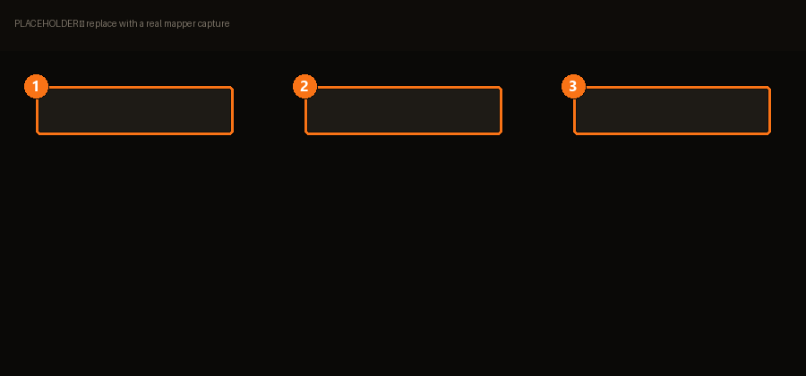

# Mapper

Certains mods sont mal empaquetés. Les fichiers sont bons ; les dossiers autour, non. Le
Mapper corrige ça sans que tu dézippes quoi que ce soit à la main.

> Réorganise la structure de ton mod pour correspondre au répertoire du jeu.

| | | |
|---|---|---|
| **1** | **Arbre source** | Ce que le mod contient réellement. |
| **2** | **Cible** | Où ces fichiers doivent atterrir pour que le jeu les voie. |
| **3** | **Diagnostic** | Montre l'emplacement final *avant* de valider. |

## Quand en as-tu besoin

Le symptôme est toujours le même : **tu installes un mod, et le jeu fait comme s'il n'existait
pas.** Neuf fois sur dix, l'archive a un dossier de trop — l'auteur a zippé le dossier
contenant au lieu de son contenu — donc le jeu cherche `Data/textures/` et trouve
`MonMod-v3/Data/textures/`.

## Vérifie avant de valider

Le **Diagnostic de structure** du Mapper existe pour une seule raison :

> Vérifie l'emplacement final de tes fichiers avant d'appliquer les changements.

Sers-t'en. Deviner un chemin puis appliquer, c'est comme ça qu'on se retrouve avec des
fichiers éparpillés dans un dossier de jeu que plus rien ne suit — exactement la situation
que toute la conception de BMM cherche à éviter.

<!-- TODO(contenu) : l'interaction glisser-pour-remapper et les stats de sous-dossiers
     attendent une capture. -->
