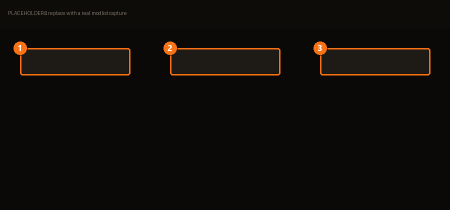

# .MM Lists

A `.MM` file is your **complete setup, written down** — and unlike a
[modpack](modpacks.md), it carries the download links, so the person receiving it doesn't
need to own the mods first.

BMM's own definition:

> A JSON file containing your complete list of mods, download links, installation order and
> conflict rules.

That's the difference in one line. A modpack says *which mods*; a `.MM` list says *which
mods, where to get them, in what order, and what to do when they clash*.

| | | |
|---|---|---|
| **1** | **Export** | Writes the `.MM` file. |
| **2** | **Import** | Reads one, then fetches and installs. |
| **3** | **Auto-profile** | Generates a dedicated profile for the imported list. |

## Sharing

> Send your `.MM` file to other users to exactly reproduce your configuration.

*Exactly* is the operative word, and it's why the order and the conflict rules travel with
the list. Two people with the same mods and a different activation order do **not** have the
same game — see [conflicts](library.md#conflicts).

### Include hashes?

An export option, and a real trade-off in BMM's own words:

> Verifiable by recipients — slower for large mods.

Include them when correctness matters (you're publishing a list, or debugging someone
else's). Skip them for a quick hand-off to a friend on a fast connection.

## Importing

BMM retrieves the archives and extracts them (*Installation in progress…*), then respects
the order the list carries. Tick **auto-profile** and it builds a dedicated
[profile](profiles.md) for the list rather than mixing it into your current one — which is
almost always what you want when trying someone else's setup.

<!-- TODO(content): the conflict-rules section of the format needs its own page. -->
