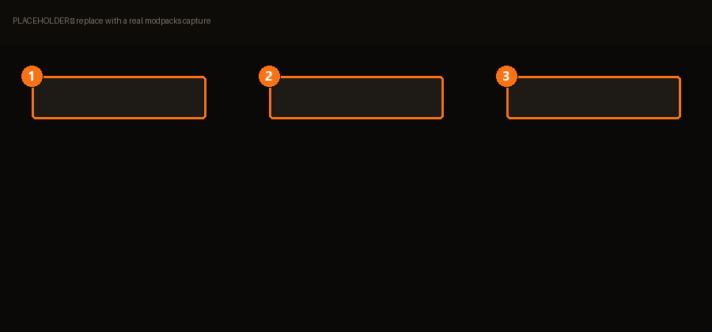

# Modpacks

Un modpack est un **lot de mods nommé, activable en un clic**. Là où un
[profil](profiles.md) répond à « ma configuration pour ce jeu », un modpack répond à « ce
groupe de mods, ensemble » — et l'écran de BMM appelle l'action *Quick Apply* : un clic
active ou désactive le pack.

| | | |
|---|---|---|
| **1** | **Carte du pack** | Le clic active ou désactive tout le pack. |
| **2** | **Exporter** | Produit un fichier à transmettre. |
| **3** | **Importer** | Lit le pack de quelqu'un d'autre. |

## Modpack ou profil ?

Ils résolvent des problèmes différents, et se tromper est la confusion habituelle :

| | Profil | Modpack |
|---|---|---|
| Répond à | « Quels mods sont actifs pour ce jeu ? » | « Quels mods vont ensemble ? » |
| Portée | Un jeu, une configuration | Un groupe, réutilisable |
| Bascule | Change toute ta configuration | N'active que ce groupe |

Un modpack peut aussi **mélanger des mods de profils différents** — l'option *multi-profil*
existe précisément pour le pack qui n'appartient pas à une seule configuration.

## Le partager : tout repose sur le hash

À l'export, BMM n'envoie pas les mods — il envoie une **signature** :

> BMM crée une signature unique (hash) pour chaque mod. Quand un ami importe ton pack, BMM
> reconnaît les mods exacts.

Le fichier reste donc léger, et « le même mod » veut dire identique à l'octet près, pas
« même nom, sans doute ». C'est ce qui fait qu'un import fonctionne exactement, ou te dit la
vérité :

> Les mods suivants ne sont pas installés sur ce PC.

Tu obtiens la liste. Rien ne s'applique à moitié en silence.

## Réparation

Si les mods d'un pack disparaissent ou se corrompent, la carte le dit — *Certains mods sont
manquants ou corrompus* — et propose **Réparer**. Utilise-le avant de déboguer le jeu : un
pack qui ne s'applique pas entièrement est une explication bien plus probable que le jeu
lui-même.

<!-- TODO(contenu) : les options du dialogue d'export attendent une capture + spec. -->
