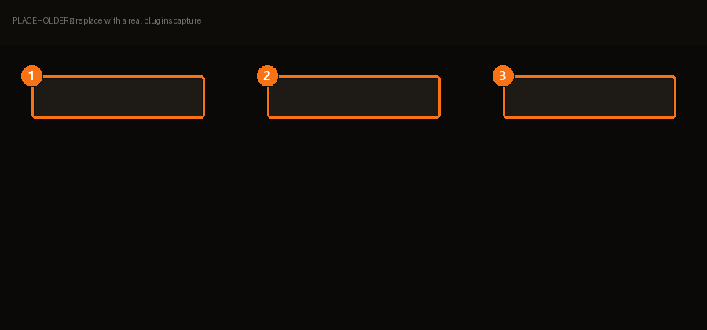

# Plugins & API

> Étends BMM avec des plugins communautaires et automatise des actions.

Si BMM ne fait pas ce dont tu as besoin, c'est ici que ça s'ajoute — sans attendre une
version.

| | | |
|---|---|---|
| **1** | **Installés** | Tes plugins. |
| **2** | **Parcourir** | Les plugins communautaires. |
| **3** | **API** | Les endpoints qu'un plugin peut appeler. |

!!! warning "Les plugins communautaires ne sont pas relus"

    BMM le dit franchement sur sa bannière : ces plugins sont créés par la communauté et ne
    sont **pas officiellement relus**. Installe depuis des gens en qui tu as une raison
    d'avoir confiance, comme pour n'importe quel autre exécutable.

    Ils sont toutefois **bornés** : un plugin agit via l'[API](../reference/api.md) avec son
    propre token, et ne fait que ce que tu lui as accordé — `mods.write`, `profiles.write`,
    etc. Relis ces autorisations dans **Plugins → Permissions**. Un plugin qui se contente de
    lire ta liste de mods a besoin de `mods.read`, et de rien d'autre.

## Le mode strict {#strict-mode}

Certains plugins appliquent une liste de mods. Le mode *strict* décide du sort de tout le
reste :

> Ce plugin va désactiver tous les mods absents de la liste.

Le mode non-strict ajoute ; le strict fait **correspondre** ta configuration à la liste,
exactement. BMM demande confirmation et te montre les mods qu'il s'apprête à éteindre — lis
cette liste plutôt que de cliquer à travers.

## Planification & automatisation

Accessible d'ici, et la raison d'être de l'API :

> Planifie des actions BMM (ponctuelles ou récurrentes) — activer un mod, un modpack, un
> profil…

Une tâche peut s'exécuter **même quand BMM est fermé** (elle s'enregistre auprès du
planificateur du système). Les règles sont évaluées de haut en bas et *la première qui
correspond gagne* — ordonne-les donc de la plus spécifique à la plus générale, exactement
comme un pare-feu.

<!-- TODO(contenu) : la référence de l'API, la liste des endpoints et les commandes
     personnalisées méritent leurs propres pages — c'est 960+ chaînes de surface. -->
