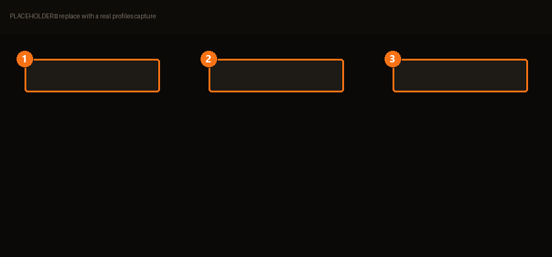

# Profiles

A profile is a saved answer to "which mods are on, in what order, for this game". It's the
screen everything else leans on — BMM's own onboarding calls it *your starting point*.

Its real job is stated on the empty screen:

> A profile is your safety net: enable, disable and reorder mods freely, and a game update
> never wipes your setup again.

| | | |
|---|---|---|
| **1** | **Profile card** | Click to make it active. Everything you enable lands here. |
| **2** | **Game folder** | Where this profile deploys. See the warning below. |
| **3** | **New profile** | One per *setup*, not one per game — you can have several. |

## Why several profiles per game

Because switching is free and reverting is instant. A typical split:

- **Vanilla-ish** — a couple of fixes, for when you want the real game.
- **Heavy** — the full stack, for when you don't.
- **Testing** — where a new mod goes first, so a bad one never touches the other two.

Switching profiles doesn't re-download anything: the mods already live in the
[Library](library.md).

## The one mistake that hurts: sharing a folder

BMM warns about this explicitly, and it's worth repeating.

!!! danger "Two profiles, one game folder"

    From BMM's own warning: sharing the same folder between multiple profiles is *a major
    source of human error*.

    Both profiles deploy into the same place, and neither knows what the other put there.
    Files survive a profile switch, and you end up debugging a mod you thought was off. Give
    each profile its own folder unless you know exactly why you're not.

## Making them yours

Profiles take an **icon** and a **background image** (with a crop step to fit the format).
This isn't decoration for its own sake: with five profiles, a glance at an icon beats
reading five names — and picking the wrong profile is the mistake this screen exists to
prevent.

## Your first profile

The moment it's created, BMM tells you what just changed:

> Your first profile is ready! Everything you enable from now on is saved right here — safe
> from game updates and reinstalls.

That's the contract. From there, [add a mod](library.md) and turn it on.

<!-- TODO(content): profile export/import and the per-profile deploy log need their own
     capture + spec before they can be documented honestly. -->
