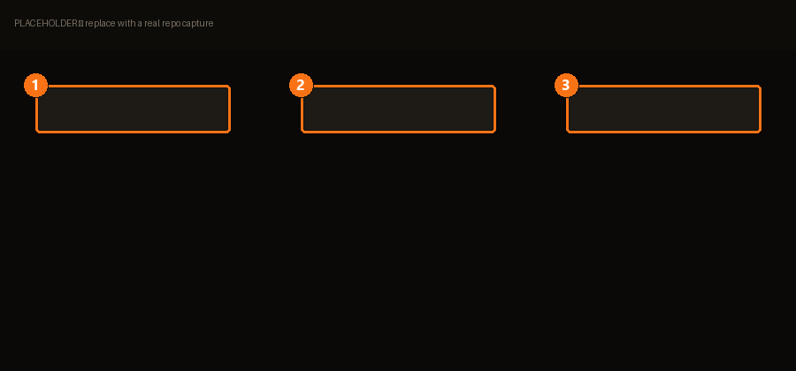

# Dépôt Serveur

Un dépôt est une **source qui prévient BMM quand un mod a une mise à jour**. Sans lui, un
mod installé à la main reste à la version installée, indéfiniment, en silence.

> Parcourir les dépôts serveur — dépôts officiels et partenaires.

| | | |
|---|---|---|
| **1** | **Liste des dépôts** | Les sources que tu as ajoutées. |
| **2** | **Parcourir** | Dépôts officiels et partenaires. |
| **3** | **Ajouter** | Pointe BMM vers l'URL d'un dépôt. |

## Lier un mod à un dépôt

Ajouter un dépôt ne suffit pas — encore faut-il y lier le mod :

> Lie ce mod à un ou plusieurs dépôts pour que BMM détecte ses mises à jour.

Un mod peut viser plusieurs dépôts. C'est voulu : si une source disparaît, le mod reste
suivi par l'autre.

## Un téléchargement direct n'a pas de version

À comprendre, parce que ça ressemble à un bug sans en être un :

> Aucune mise à jour détectée. Un téléchargement direct n'a pas de version, BMM ne peut donc
> pas savoir s'il est plus récent.

L'URL d'un fichier brut ne porte aucun numéro de version : BMM n'a rien à comparer. Il
propose un **retéléchargement direct** plutôt que de faire semblant de savoir. Pour une vraie
détection de mises à jour, lie le mod à un dépôt qui publie des versions.

## Héberger le tien

Un dépôt peut être le tien — voir [BetterCommunity](community.md), qui héberge des dépôts et
sert le flux que BMM lit. Les propriétaires disposent d'un contrôle d'accès (listes blanches,
bannissements par IP ou clé de créateur).

<!-- TODO(contenu) : le tableau de bord du dépôt, la gestion des bans et les règles d'accès
     méritent leur page une fois capturés. -->
