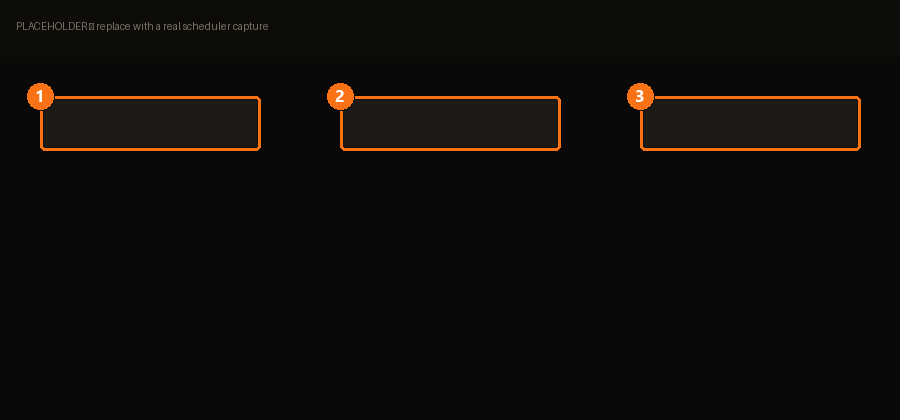

# Scheduling & automation

> Schedule BMM actions (one-time or recurring) — activate a mod, modpack, profile…

Reachable from [Plugins & API](plugins.md). This is the part of BMM that does things while
you're not looking.

| | | |
|---|---|---|
| **1** | **Trigger** | *When* it runs. |
| **2** | **Rules** | *Whether* it runs, and what it does. |
| **3** | **New task** | One task, one job. |

*Placeholder recording — a focused clip of this screen will replace it.*

## A task has three parts

**Trigger → rules → action.** The trigger asks *when*, the rules ask *whether*, the action is
*what*.

### 1. Trigger — when

| Type | Runs |
|---|---|
| `once` | One time, at a date and time. |
| `interval` | Every N minutes. |
| `hourly` | Every N hours. |

There's also a monthly option, built through the OS's own scheduling classes rather than a
simple cmdlet — so it exists, it's just assembled differently under the hood.

### 2. Rules — whether

A rule is `IF <condition> THEN <action>`, and this is where the scheduler stops being a
timer and starts being useful. Conditions:

| Condition | True when |
|---|---|
| `Always` | Unconditionally. |
| `Profile is active` | A given [profile](profiles.md) is the current one. |
| `Mod is enabled` / `Mod is disabled` | A given mod's state. |
| `Modpack is active` | A [modpack](modpacks.md) is applied. |
| `All active-profile mods are on` | Nothing in the profile is off. |
| `App is running` | A process is up — e.g. the game itself. |
| `Day of week` | Monday…Sunday. |
| `Time is within` | A time range. |
| `Value compare` | `if X > Y` — a numeric comparison. |
| `Command succeeds` | An external command exits 0. |

!!! warning "First match wins"

    From the scheduler's own empty state: *No rules — add one. **First matching row wins**
    (top to bottom).*

    Order your rules **most specific first**, exactly like firewall rules. A rule with
    `Always` at the top makes every rule below it dead code — and nothing will tell you,
    because as far as the scheduler is concerned it did its job.

### 3. Action — what

| | |
|---|---|
| **Mods** | Enable / disable one · enable all · disable all · scan the mods folder |
| **Profiles** | Activate a profile |
| **Modpacks** | Enable / disable |
| **App** | Launch an app · run a benchmark · set a theme |
| **Other** | Show a notification · run a `bmm://` deeplink · run a custom command |

## Running when BMM is closed

> Run even when BMM is closed.

This registers the task with **your operating system's scheduler**, not BMM's own loop. The
OS wakes it up on time whether or not the app is running — which is the whole point for
"prepare my modpack at 6am".

It also means the task lives outside BMM. Deleting it in BMM removes the OS task too; if you
go poking in your OS's task list, that's what those entries are.

## Custom commands

> Allow custom commands.

Off by default, and rightly: a scheduled task that can run arbitrary commands is a scheduled
task that can do anything, at a time you're not watching. Turn it on when you need it, and
know what the command does.

## Example

The scheduler ships one, and it's a good shape to copy:

> Every hour, loop 3× and show a notification each time.

Start there, swap the notification for a real action, and add a condition so it only fires
when it should.

## Conditions — *whether*

A task can carry conditions so it only acts when the state is right. Each condition can be
**negated** ("*not* online"), and they're used two ways: to gate an action (`if`), or to hold
until something becomes true (`waitFor`, below).

| Condition | True when |
|---|---|
| `always` | Always — the default, no gate. |
| `profileActive` | A specific profile is the active one. |
| `modEnabled` · `modDisabled` | A specific mod is on / off. |
| `modpackActive` · `modpackInactive` | Every mod in a modpack is on / off. |
| `allModsActive` | Every mod in the active profile is on. |
| `appRunning` · `appNotRunning` | A process (by name) is / isn't running. |
| `online` | The machine has an internet connection. |
| `dayOfWeek` | Today is one of the days you picked. |
| `timeRange` · `timeReached` | The clock is inside a range / has passed a time. |
| `fileExists` · `fileHash` · `fileSize` · `fileType` | File checks — a path exists, or its hash (blake3/sha256), size or type matches. |
| `commandSucceeds` | An external command runs and exits `0`. |
| `value` | A captured number compares against a threshold (below). |

### The `value` condition

`value` compares a number BMM captured earlier in the run — for example a disk's measured
write speed (`disk.write_mbps`) or a benchmark result (`benchmark.mbps`) — against a threshold
you set, using one of six operators:

`>` · `<` · `>=` · `<=` · `==` · `!=`

So "*if `disk.write_mbps` `<` 50, show a warning*" becomes a real rule. If the source value was
never captured, the condition is simply false — it won't fire on missing data.

## Loops & waiting

Beyond a flat list of actions, a task can branch and repeat:

| Block | What it does |
|---|---|
| **`if`** | Runs one set of steps when a condition holds, another (`else`) when it doesn't. |
| **`repeat`** | Runs its steps repeatedly — `while` a condition holds, `until` one does, or a fixed number of `times`. `everySec` sets the gap between iterations, and **`maxIters` is a hard safety cap** so a `while`/`until` loop can never run forever. |
| **`waitFor`** | Pauses until a condition becomes true, polling every `pollSec`, up to `timeoutSec`. On timeout it either **aborts** the task or **continues** anyway — your choice. |

The bundled example is a `repeat` in `times` mode (loop 3×). Swap the mode to `while`/`until`
and give it a `value` or `appRunning` condition, and you have automations like "*keep checking
until the game process exits, then export my data*".

