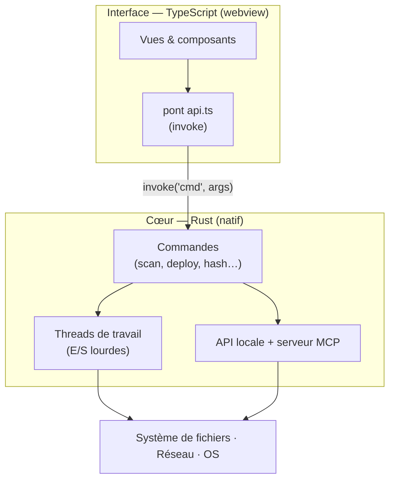
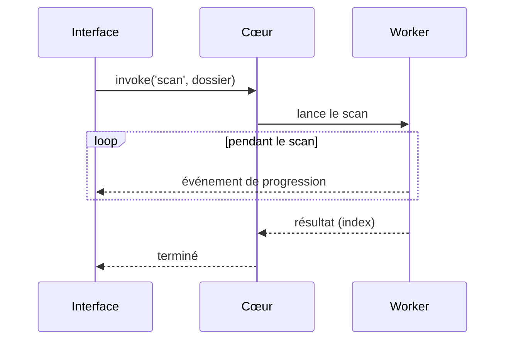

# Architecture

BMM est une **application native de bureau qui a une interface web** — pas un navigateur qui se fait
passer pour une app. Ce seul choix explique pourquoi il démarre vite, tourne au repos à quelques
dizaines de Mo, et peut hacher des gigaoctets sans se figer.

## Les trois couches

- **Interface (TypeScript)** — tout ce que vous voyez. Elle ne touche jamais le disque directement ;
  elle le demande au cœur. L'état vit dans le cœur, donc l'interface peut être rechargée sans rien
  perdre.
- **Cœur (Rust)** — la partie qui fait le vrai travail : scanner, hacher, copier, réseau. C'est du
  code natif compilé, donc rapide et sobre en mémoire.
- **Le pont** — l'interface appelle le cœur via un unique canal typé `invoke(commande, args)`. Si le
  pont n'est pas prêt au démarrage, les appels attendent au lieu d'échouer.

## Pourquoi pas Electron ?

Une app Electron embarque une copie complète de Chromium (~150&nbsp;Mo) et exécute votre logique en
JavaScript. BMM utilise la **webview native de l'OS** pour l'interface et fait le gros du travail en
Rust. Résultat : une fraction de la taille et de la mémoire, et des opérations fichier à vitesse
native au lieu de passer par un moteur JS.

## Garder l'interface réactive

Les longues tâches ne tournent jamais sur le thread de l'interface. Un scan ou un déploiement est
confié à un **worker**, qui renvoie la progression en flux pour que l'interface reste vivante et
annulable.

Pour les opérations les plus lourdes, BMM peut même relancer son propre binaire comme
**sous-processus** éphémère qui fait les E/S puis se termine — ainsi un pic de mémoire ou un rare
plantage dans ce travail ne peut pas emporter toute l'application.

!!! info "À voir dans l'app"
    Aide &amp; autre → Développeur → **La stack technique**, **Moteur et threads**, et
    **Architecture légère**.
