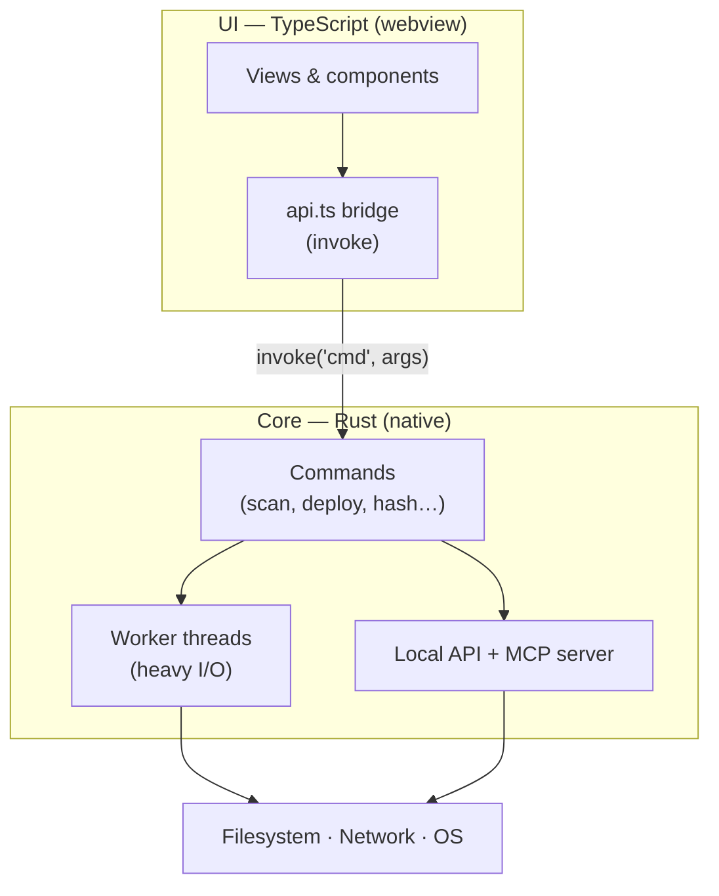
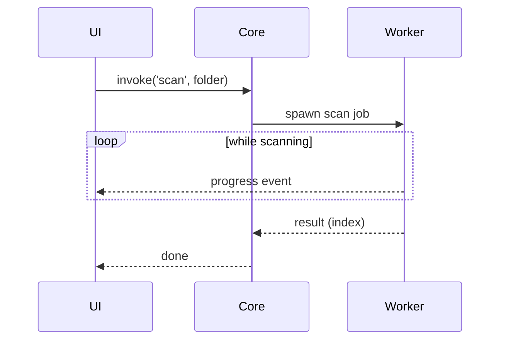

# Architecture

BMM is a **native desktop app that happens to have a web UI** — not a browser pretending to be
an app. That one choice is why it launches fast, idles at a few dozen MB, and can hash gigabytes
without freezing.

## The three layers

- **UI (TypeScript)** — everything you see. It never touches the disk directly; it asks the
  core to. State lives in the core, so the UI can be reloaded without losing anything.
- **Core (Rust)** — the part that does real work: scanning, hashing, copying, networking. It's
  compiled native code, so it's fast and memory-lean.
- **The bridge** — the UI calls the core through a single typed `invoke(command, args)` channel.
  If the bridge isn't ready yet at startup, calls wait for it rather than failing.

## Why not Electron?

An Electron app ships a whole copy of Chromium (~150&nbsp;MB) and runs your logic in JavaScript.
BMM uses the **OS's own webview** for the UI and does the heavy lifting in Rust. The result is a
fraction of the size and memory, and file operations run at native speed instead of through a JS
runtime.

## Keeping the UI responsive

Long jobs never run on the UI thread. A scan or a deploy is handed to a **worker**, which streams
progress back so the interface stays live and cancellable.

For the very heaviest file operations BMM can even re-invoke its own binary as a short-lived
**subprocess** that does the I/O and exits — so a spike in memory or a rare crash in that work
can't take the whole app down with it.

!!! info "See it in the app"
    Help &amp; other → Developer → **The tech stack**, **Engine &amp; threads**, and
    **Lightweight architecture**.
