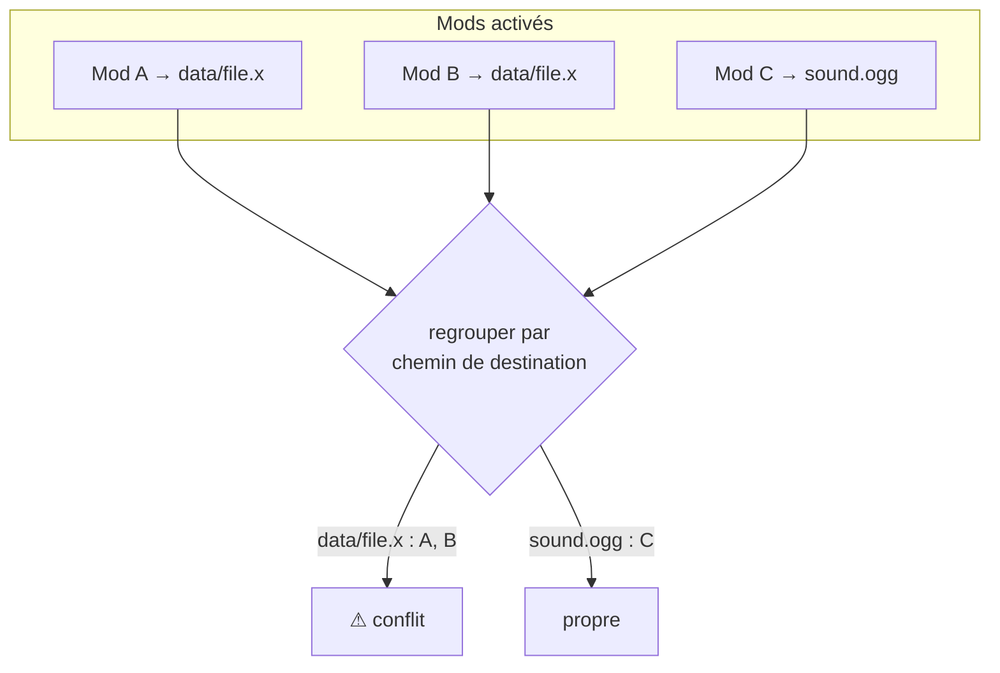
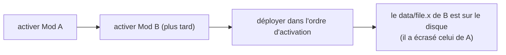

# Conflits

Deux mods sont en **conflit** quand ils fournissent le même fichier. Certains gestionnaires laissent
l'un écraser l'autre en silence. BMM détecte le chevauchement *avant* toute écriture et vous
prévient — mais la résolution elle-même est volontairement simple.

## La détection n'est qu'une recherche dans l'index

Comme chaque fichier est indexé par son chemin de destination, trouver les conflits est un simple
regroupement — aucun accès disque. Tout chemin revendiqué par plus d'un mod activé est un conflit.

## Qui gagne : le dernier mod que vous activez

Il n'y a **pas de sélecteur de gagnant par fichier ni de liste de priorité**. La règle est simple :
**le dernier mod que vous activez gagne.** Au déploiement, les fichiers de chaque mod sont copiés
dans le dossier du jeu dans l'ordre d'activation, si bien qu'un mod plus tardif écrase un plus ancien
sur tout chemin partagé. Votre seul levier est l'**ordre dans lequel vous activez les mods** —
activez en dernier celui qui doit gagner.

## Rien n'est perdu

Avant qu'un mod n'écrase un fichier, BMM sauvegarde le **fichier de jeu d'origine** (dans
`_original/`) s'il ne l'a pas déjà fait. Quand vous désactivez le mod gagnant, BMM restaure le
fichier partagé depuis le mod activé suivant qui le fournit aussi — ou, à défaut, le fichier de jeu
d'origine. Ainsi, même si la résolution est « le dernier gagne », la désactivation vous ramène
toujours à un état propre.

!!! info "À voir dans l'app"
    Aide &amp; autre → Développeur → **Gestion des conflits** ; le tutoriel **Conflits**.
