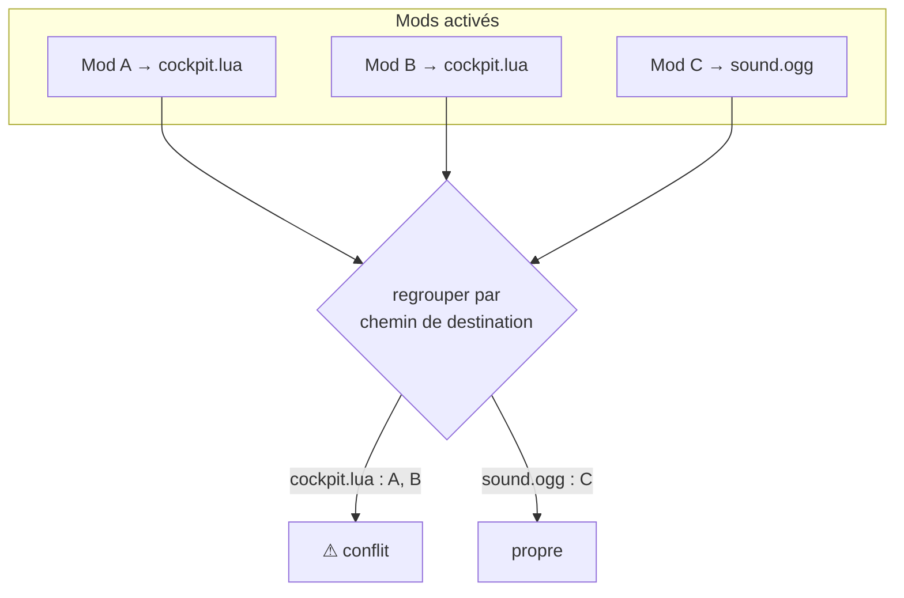
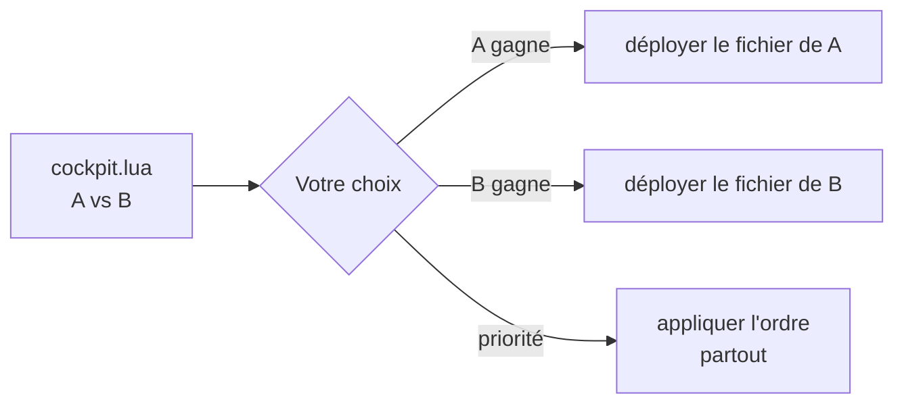

# Résolution de conflits

Deux mods sont en **conflit** quand ils fournissent le même fichier. Dans la plupart des gestionnaires,
celui activé en dernier gagne en silence. BMM refuse le silence : il détecte le chevauchement depuis
l'index *avant* toute écriture, et vous demande.

## La détection n'est qu'une recherche dans l'index

Comme chaque fichier est indexé par son chemin de destination, trouver les conflits est un simple
regroupement — aucun accès disque. Tout chemin revendiqué par plus d'un mod activé est un conflit.

## Résoudre

Pour chaque fichier en conflit, vous choisissez un gagnant, ou vous définissez un **ordre de
priorité** pour que le mod prioritaire gagne partout où il chevauche. Vos décisions sont stockées **par
profil**, si bien que les deux mêmes mods peuvent se résoudre différemment dans un profil « proche du
vanilla » et un profil « tout inclus ».

Une fois résolu, le déploiement est sans ambiguïté — BMM écrit exactement le fichier gagnant pour
chaque chemin, et note de quel mod il vient pour que la désactivation reste propre.

!!! info "À voir dans l'app"
    Aide &amp; autre → Développeur → **Gestion des conflits** ; le tutoriel **Conflits**.
