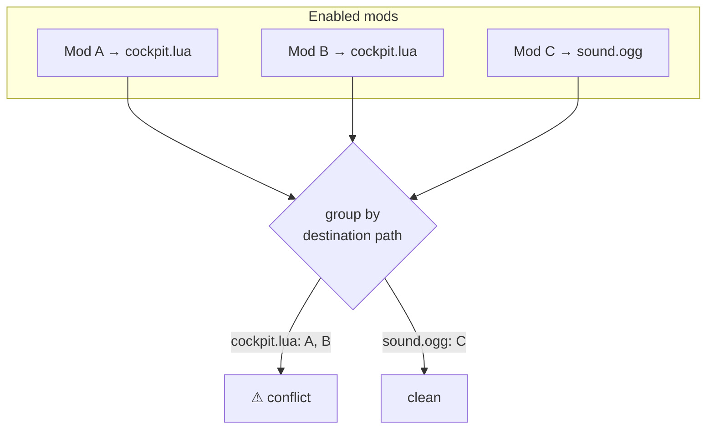
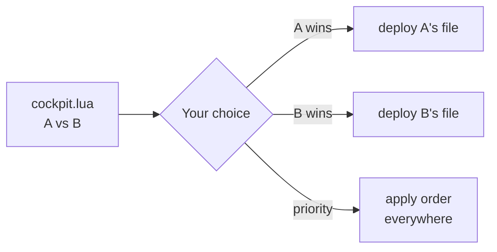

# Conflict resolution

Two mods are in **conflict** when they ship the same file. In most managers the one activated last
silently wins. BMM refuses to be silent: it detects the overlap from the index *before* anything is
written, and asks you.

## Detection is just an index lookup

Because every file is indexed by its destination path, finding conflicts is a grouping operation —
no disk access needed. Any path claimed by more than one enabled mod is a conflict.

## Resolving

For each conflicting file you pick a winner, or set a **priority order** so the higher-priority mod
wins wherever it overlaps. Your decisions are stored **per profile**, so the same two mods can
resolve differently in "vanilla-ish" and "kitchen-sink" setups.

Once resolved, the deploy is unambiguous — BMM writes exactly the winning file for each path, and
records which mod it came from so deactivation stays clean.

!!! info "See it in the app"
    Help &amp; other → Developer → **Conflict management**; the **Conflicts** tutorial.
