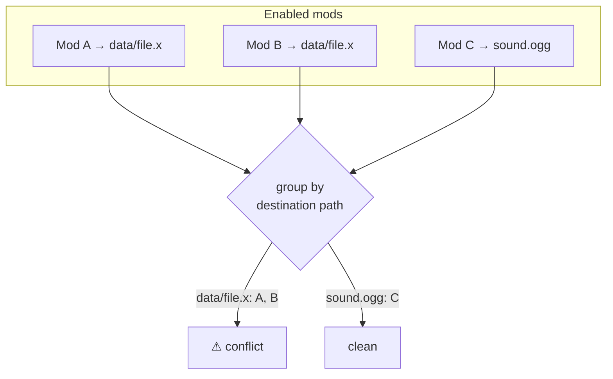
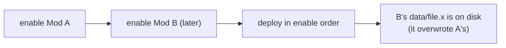

# Conflicts

Two mods are in **conflict** when they ship the same file. Some managers let one silently overwrite
the other. BMM detects the overlap *before* it writes anything and warns you — but the resolution
itself is deliberately simple.

## Detection is just an index lookup

Because every file is indexed by its destination path, finding conflicts is a grouping operation —
no disk access needed. Any path claimed by more than one enabled mod is a conflict.

## Who wins: the last mod you enable

There is **no per-file winner picker and no priority list**. The rule is simply: **whichever mod you
enable last wins.** When BMM deploys, each mod's files are copied into the game folder in enable
order, so a later mod overwrites an earlier one on any shared path. Your only control is the **order
you enable mods in** — enable the one that should win last.

## Nothing is lost

Before a mod overwrites a file, BMM backs up the **original game file** (into `_original/`) if it
hasn't already. When you disable the winning mod, BMM restores the shared file from the next enabled
mod that also provides it — or, failing that, the original game file. So even though resolution is
last-wins, deactivation always lands you somewhere clean.

!!! info "See it in the app"
    Help &amp; other → Developer → **Conflict management**; the **Conflicts** tutorial.
