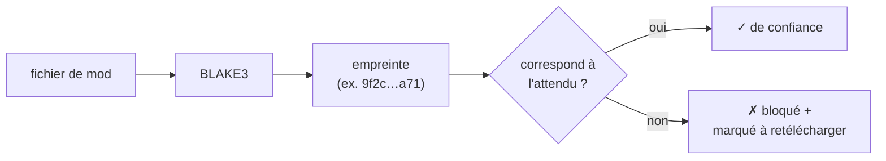
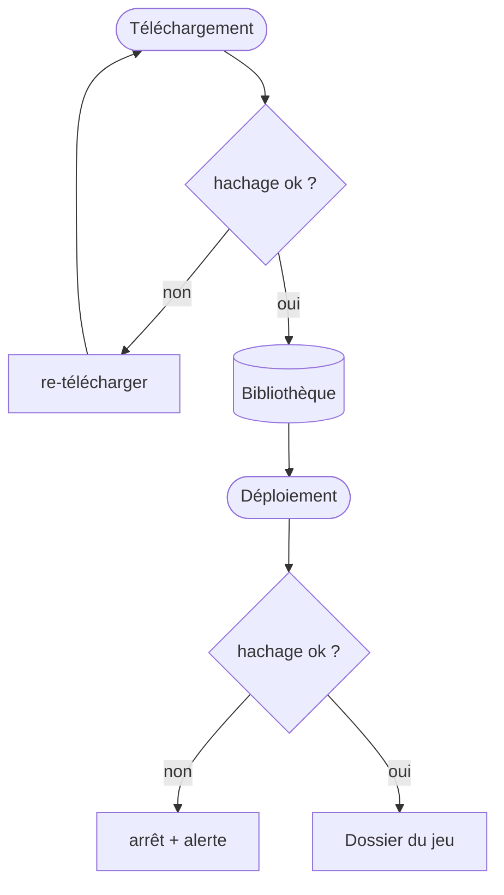

# Intégrité & hachage

Un mod n'est utile que s'il contient les *bons* octets. Un téléchargement tronqué, un disque
capricieux ou un fichier altéré ne devraient jamais atteindre votre jeu en silence. La réponse de BMM :
tout hacher et comparer.

## BLAKE3, et pourquoi

Chaque fichier reçoit un hachage de contenu **BLAKE3** — une empreinte courte qui change complètement
si un seul octet change. BLAKE3 est le choix moderne ici car il est cryptographiquement solide *et*
extrêmement rapide : il se parallélise sur les cœurs du CPU, donc hacher un gros mod est limité par
votre disque, pas par l'algorithme.

## Où le contrôle a lieu

La même empreinte est réutilisée partout :

- **Après un téléchargement** — le fichier correspond-il à ce que la source a promis ? Sinon, il est
  rejeté avant de pouvoir être déployé.
- **Avant un déploiement** — la copie de la Bibliothèque est-elle toujours intacte ?
- **Dans un dépôt serveur** — le client d'un membre compare les empreintes avec l'hôte pour savoir
  précisément quels fichiers manquent ou sont périmés, et ne transfère que ceux-là.

Comme le contrôle porte sur le contenu, il détecte une corruption qu'aucun test de nom ou de taille ne
verrait — deux fichiers peuvent partager nom et taille et différer par l'octet qui compte.

!!! info "À voir dans l'app"
    Aide &amp; autre → Développeur → **Hachage BLAKE3** et **Moteur d'intégrité**.
