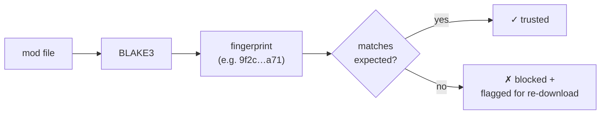
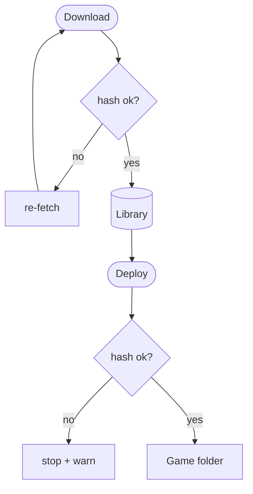

# Integrity & hashing

A mod is only useful if it's the *right* bytes. A truncated download, a flaky drive, or a
tampered file should never reach your game silently. BMM's answer is to hash everything and
compare.

## BLAKE3, and why

Every file gets a **BLAKE3** content hash — a short fingerprint that changes completely if a
single byte does. BLAKE3 is the modern choice here because it's cryptographically strong *and*
extremely fast: it parallelises across CPU cores, so hashing a large mod is limited by your disk,
not the algorithm.

## Where the check happens

The same fingerprint is reused everywhere:

- **After a download** — does the file match what the source promised? If not, it's rejected
  before it can be deployed.
- **Before a deploy** — is the Library copy still intact?
- **In a server repo** — a member's client compares fingerprints with the host to know precisely
  which files are missing or stale, and transfers only those.

Because the check is content-based, it catches corruption no filename or size check would — two
files can share a name and size and still differ by the one byte that matters.

!!! info "See it in the app"
    Help &amp; other → Developer → **BLAKE3 hashing** and **Integrity engine**.
