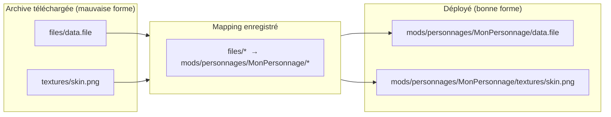

# Le mappeur

BMM déploie un mod en recopiant son arborescence dans le jeu. Cela ne marche que si le mod *possède* la
bonne arborescence. Beaucoup de téléchargements ne l'ont pas — l'auteur a zippé depuis le mauvais
dossier, ou a jeté les fichiers en vrac à la racine. Le mappeur corrige cela une fois, et s'en
souvient.

## La forme attendue

Un mod stocké doit contenir le chemin complet attendu par le jeu, à partir de sa racine. Par
exemple :

```
\Mon Mod Génial
   |_ mods
        |_ personnages
             |_ MonPersonnage
```

`Mon Mod Génial` est le mod ; tout ce qui est en dessous est l'arborescence exacte où les fichiers
doivent atterrir. Les noms de dossiers ici (`mods`, `personnages`, …) ne sont qu'un exemple —
utilisez le chemin que lit **votre** jeu.

## Ce que fait le mappeur

C'est une table de traduction entre *l'endroit d'un fichier dans l'archive* et *l'endroit où il doit
aller dans le jeu*. Vous la construisez en glissant, et elle est enregistrée avec le mod — la
prochaine installation, ou le re-téléchargement d'une nouvelle version au même agencement, s'applique
instantanément.



Comme le mapping est une donnée, pas un déplacement manuel ponctuel, il est **répétable et versionné
avec le mod** — tout l'intérêt de le faire dans BMM plutôt que de réorganiser des dossiers à la main
dans l'Explorateur.

!!! info "À voir dans l'app"
    Aide &amp; autre → Développeur → **Mappeur de mods** ; le tutoriel **Mappeur**. Et la page
    [Mapper](../features/mapper.md) du guide utilisateur pour la prise en main.
