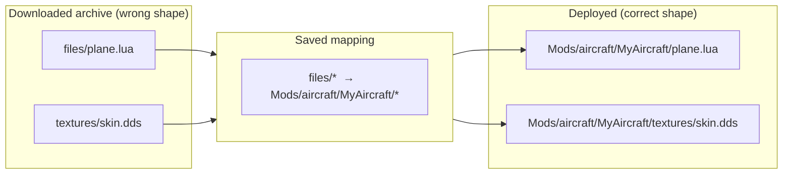

# The mapper

BMM deploys a mod by mirroring its folder tree into the game. That only works if the mod *has* the
right tree. Plenty of downloads don't — the author zipped from the wrong folder, or dumped loose
files at the root. The mapper fixes that once, and remembers.

## The expected shape

A stored mod must contain the full path the game expects, starting from the game root. For an
aircraft mod that's:

```
\My Awesome Mod
   |_ Mods
        |_ aircraft
             |_ MyAircraft
```

`My Awesome Mod` is the mod; everything under it is the exact tree the files must land in.

## What the mapper does

It's a translation table from *where a file is in the archive* to *where it belongs in the game*.
You build it by dragging, and it's saved with the mod — so the next install, or a re-download of a
new version with the same layout, applies instantly.



Because the mapping is data, not a one-off manual move, it's **repeatable and versioned with the
mod** — the whole point of doing it in BMM instead of reshaping folders by hand in Explorer.

!!! info "See it in the app"
    Help &amp; other → Developer → **Mod mapper**; the **Mapper** tutorial. And the user guide's
    [Mapper](../features/mapper.md) page for the hands-on walkthrough.
