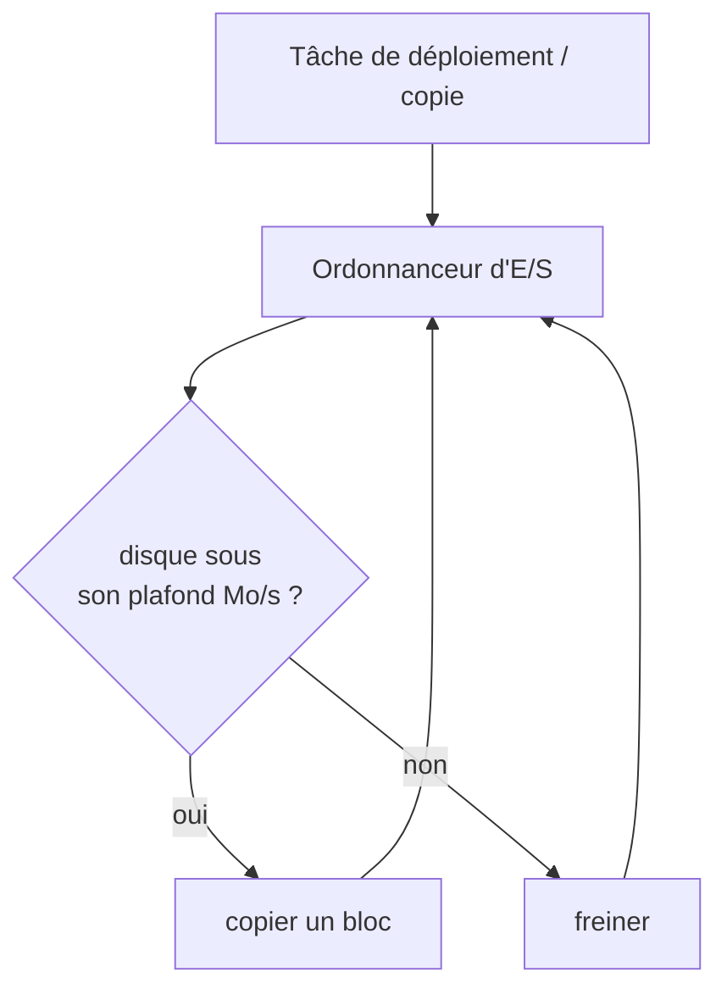
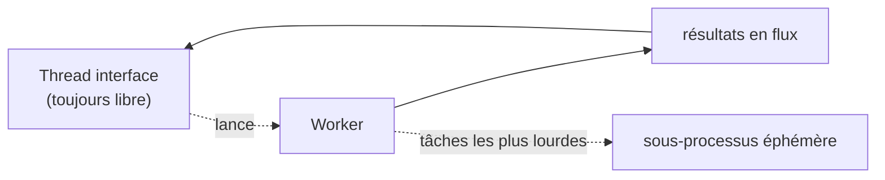

# Performances

Modder, c'est déplacer beaucoup d'octets. Le rôle de BMM est de le faire vite **et** de garder votre
machine utilisable pendant ce temps. Deux idées le permettent : ne jamais bloquer l'interface, et ne
jamais saturer un disque.

## Smart I/O et le limiteur de disque

Copier à fond peut monopoliser un disque et faire saccader tout le système — BMM compris. Les copies
passent donc par un **limiteur de débit** que vous contrôlez par disque. Sous le plafond, le travail
va à fond ; à l'approche, BMM se régule pour que le disque (et l'app) restent réactifs.

Le « Smart I/O » choisit aussi l'opération correcte la moins coûteuse pour chaque fichier — un **lien
physique** quand source et destination sont sur le même volume (instantané, zéro octet copié), une
vraie copie seulement quand c'est nécessaire.

## Rester léger

Le travail lourd est renvoyé en flux depuis un worker pour que l'interface ne gèle jamais, et les
tâches les plus grosses peuvent tourner dans un sous-processus jetable dont la mémoire est récupérée
dès qu'il se termine. Résultat : une app qui reste petite au repos et ne monte que le temps d'une
tâche réelle.

!!! tip "Mesurez-le vous-même"
    BMM embarque une suite de benchmarks (débit scan / hachage / copie) pour voir ces chiffres sur
    votre propre matériel. Voir Aide &amp; autre → Développeur → **Limiteur d'E/S disque** et
    **Hachage BLAKE3**.
