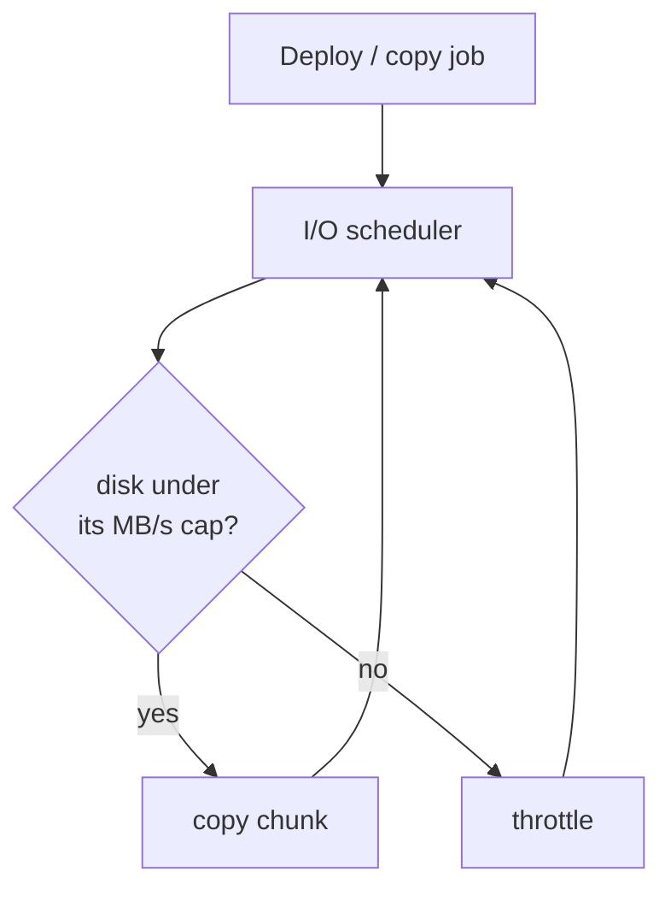
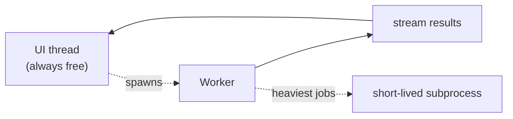

# Performance

Modding means moving a lot of bytes. BMM's job is to do that fast **and** keep your machine usable
while it happens. Two ideas make that possible: never block the UI, and never saturate a disk.

## Smart I/O and the disk limiter

Copying at full tilt can peg a drive and make the whole system stutter — including BMM itself. So
copies run through a **rate limiter** you control per disk. Under the cap, work runs flat-out; near
it, BMM paces itself so the drive (and the app) stay responsive.

"Smart I/O" also picks the cheapest correct operation for each file — a **hard-link** when source
and destination share a volume (instant, zero bytes copied), a real copy only when it must.

## Staying lean

Heavy work is streamed from a worker so the interface never freezes, and the very largest jobs can
run in a throwaway subprocess whose memory is reclaimed the instant it exits. The result is an app
that idles small and spikes only as long as a job actually runs.

!!! tip "Measure it yourself"
    BMM ships a benchmark suite (scan / hash / copy throughput) so you can see these numbers on
    your own hardware. See Help &amp; other → Developer → **Disk I/O limiter** and **BLAKE3 hashing**.
