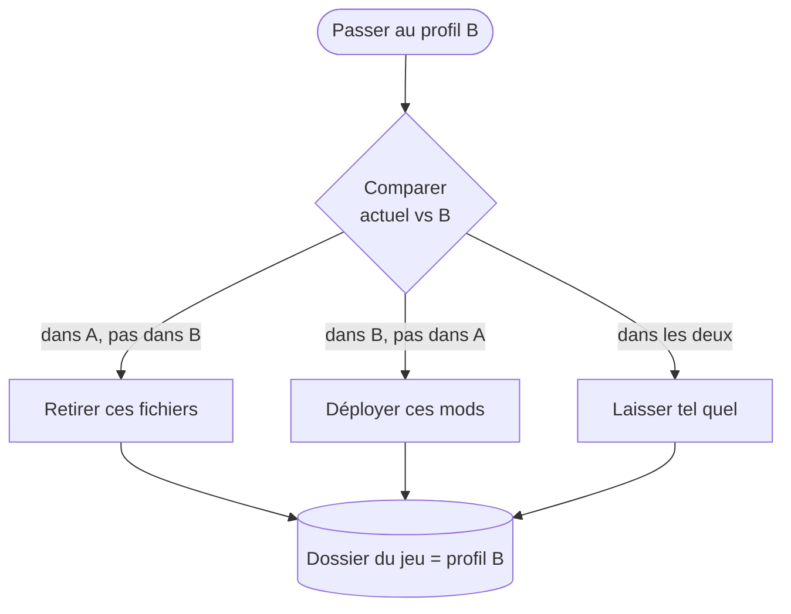
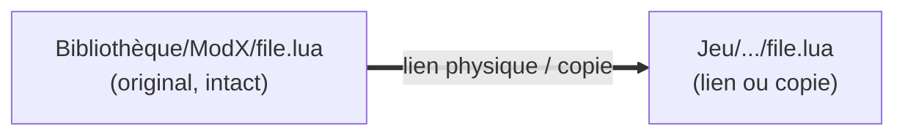

# Profils & activation

Un profil est un petit enregistrement — un nom, un dossier de jeu cible, et une **liste ordonnée des
mods actifs**. Il ne stocke aucun fichier de mod. C'est pourquoi vous pouvez avoir une douzaine de
profils pour presque rien.

## Ce que « activer » fait vraiment

Activer un profil réconcilie le dossier du jeu avec la liste du profil. BMM sait exactement quels
fichiers sur le disque appartiennent à quel mod (il l'a noté au déploiement), il n'a donc à toucher
que la différence.

Passer d'un profil de 200 mods à un profil presque identique ne déplace que la poignée qui diffère —
c'est donc instantané, pas un redéploiement complet.

## Non destructif par construction

Le déploiement ne *sort* jamais vos originaux de la Bibliothèque. Selon le réglage et le système de
fichiers, BMM crée un **lien physique** (deux noms, un seul fichier sur le disque — zéro espace en
plus) ou copie. Dans tous les cas la Bibliothèque garde sa copie intacte.

Ainsi « désinstaller d'un profil » revient à « retirer le lien » — le mod retourne sur l'étagère,
prêt pour un autre profil. La suppression que redoutent les débutants est en fait une annulation.

## Déploiements transactionnels

Une activation s'applique d'un bloc. Si elle est interrompue à mi-chemin — coupure de courant,
fermeture forcée — BMM revient au dernier état cohérent au lieu de laisser le dossier du jeu dans un
mélange bâtard de deux profils.

!!! info "À voir dans l'app"
    Aide &amp; autre → Développeur → **Système de profils**, et le tutoriel **Profils**.
