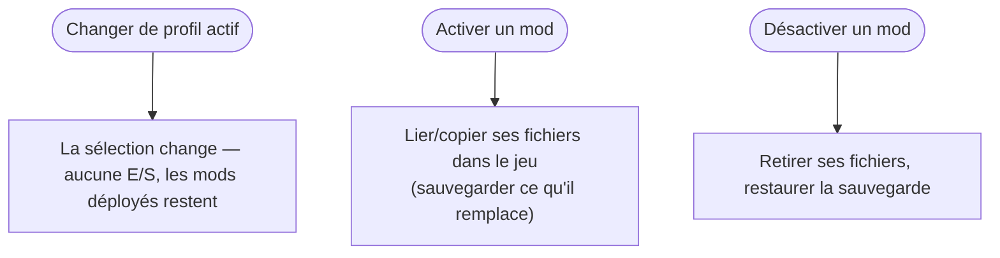
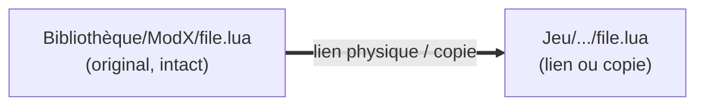

# Profils & activation

Un profil est un petit enregistrement — un nom, un dossier de jeu cible, et une **liste ordonnée des
mods actifs**. Il ne stocke aucun fichier de mod. C'est pourquoi vous pouvez avoir une douzaine de
profils pour presque rien.

## Changer de profil vs. activer un mod

Deux actions faciles à confondre, et une seule touche à vos fichiers :

- **Changer de profil actif** modifie seulement *le profil dans lequel vous travaillez*. Ça ne
  déplace **aucun fichier** — ce qui est déjà déployé dans le dossier du jeu reste exactement en
  place. Le profil actif n'est qu'un pointeur de sélection, rien de plus.
- **Activer ou désactiver un mod** est la seule chose qui touche au dossier du jeu.

L'état activé est suivi **par racine (dossier du jeu + dossier des mods)** : deux profils pointant
vers les mêmes dossiers reflètent leurs mods activés — un mod ne peut pas être activé dans deux
d'entre eux à la fois. Les profils avec des dossiers *différents* sont des configurations totalement
indépendantes. Pour de vrais loadouts séparés, donnez à chaque profil son propre dossier de mods.

## Non destructif par construction

Le déploiement ne *sort* jamais vos originaux de la Bibliothèque. Selon le réglage et le système de
fichiers, BMM crée un **lien physique** (deux noms, un seul fichier sur le disque — zéro espace en
plus) ou copie. Dans tous les cas la Bibliothèque garde sa copie intacte.

Ainsi « désinstaller d'un profil » revient à « retirer le lien » — le mod retourne sur l'étagère,
prêt pour un autre profil. La suppression que redoutent les débutants est en fait une annulation.

## Déploiements transactionnels

Une activation s'applique d'un bloc. Si elle est interrompue à mi-chemin — coupure de courant,
fermeture forcée — BMM revient au dernier état cohérent au lieu de laisser le dossier du jeu dans un
mélange bâtard de deux profils.

!!! info "À voir dans l'app"
    Aide &amp; autre → Développeur → **Système de profils**, et le tutoriel **Profils**.
