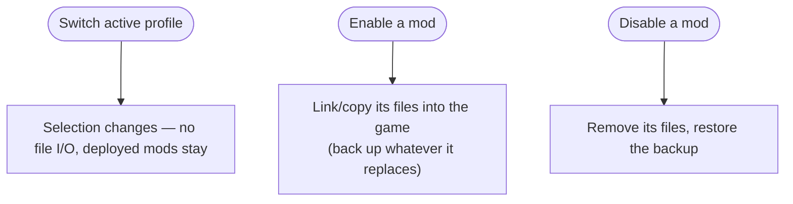
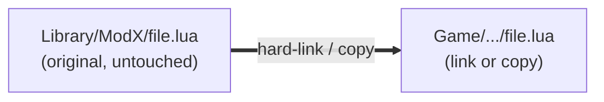

# Profiles & activation

A profile is a small record — a name, a target game folder, and an **ordered list of which mods
are on**. It stores no mod files itself. That's why you can have a dozen profiles and they cost
almost nothing.

## Switching a profile vs. enabling a mod

Two actions are easy to confuse, and only one of them touches your files:

- **Switching the active profile** just changes *which profile you're working in*. It moves **no
  files** — whatever is already deployed in the game folder stays exactly where it is. The active
  profile is a single selection pointer, nothing more.
- **Enabling or disabling a mod** is the only thing that touches the game folder.

Enabled-state is tracked **per (game folder + mods folder) root**: two profiles pointing at the same
folders mirror each other's enabled mods — a mod can't be enabled in two of them at once. Profiles
with *different* folders are fully independent setups. So to keep genuinely separate mod loadouts,
give each profile its own mods folder.

## Non-destructive by construction

Deploying never *moves* your originals out of the Library. Depending on the setting and the
filesystem, BMM either **hard-links** (two names, one file on disk — zero extra space) or copies.
Either way the Library keeps its pristine copy.

So "uninstall from a profile" is really "remove the link" — the mod drops back onto the shelf,
ready for another profile. The delete newcomers fear is actually an undo.

## Transactional deploys

An activation is applied as a unit. If it's interrupted half-way — power cut, force-quit — BMM
rolls back to the last consistent state instead of leaving the game folder in a Frankenstein mix
of two profiles.

!!! info "See it in the app"
    Help &amp; other → Developer → **Profile system**, and the **Profiles** tutorial.
