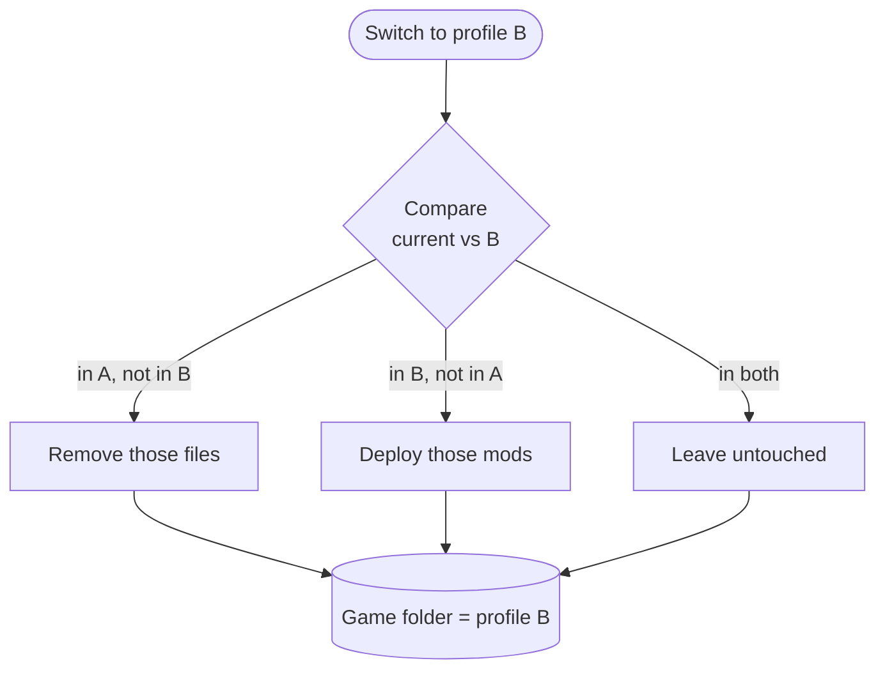
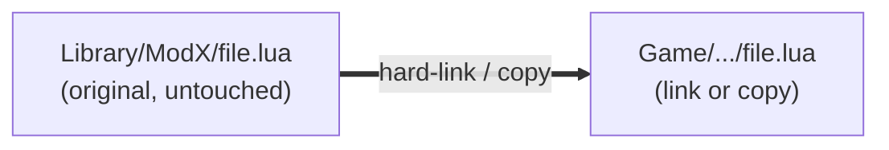

# Profiles & activation

A profile is a small record — a name, a target game folder, and an **ordered list of which mods
are on**. It stores no mod files itself. That's why you can have a dozen profiles and they cost
almost nothing.

## What "activate" actually does

Activating a profile reconciles the game folder with the profile's list. BMM knows exactly which
files on disk belong to which mod (it recorded that when the mod was deployed), so it only has to
touch the difference.

Switching from a 200-mod profile to a near-identical one only moves the handful that differ — so
it's instant, not a full redeploy.

## Non-destructive by construction

Deploying never *moves* your originals out of the Library. Depending on the setting and the
filesystem, BMM either **hard-links** (two names, one file on disk — zero extra space) or copies.
Either way the Library keeps its pristine copy.

So "uninstall from a profile" is really "remove the link" — the mod drops back onto the shelf,
ready for another profile. The delete newcomers fear is actually an undo.

## Transactional deploys

An activation is applied as a unit. If it's interrupted half-way — power cut, force-quit — BMM
rolls back to the last consistent state instead of leaving the game folder in a Frankenstein mix
of two profiles.

!!! info "See it in the app"
    Help &amp; other → Developer → **Profile system**, and the **Profiles** tutorial.
