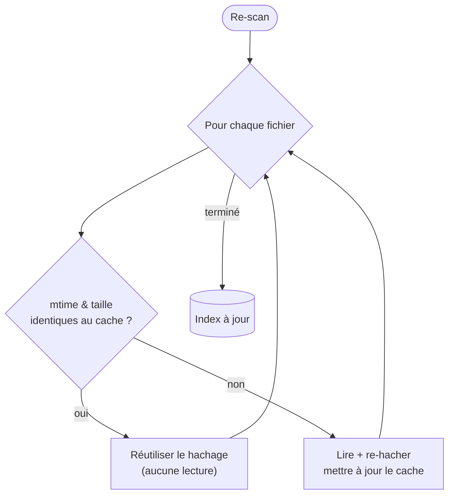

# Scan & cache

La première fois que BMM voit votre dossier de mods, il construit un **index** : pour chaque fichier,
un chemin, une taille, une date de modification et un hachage de contenu. Tout le reste — détection de
conflits, intégrité, « qu'est-ce qui a changé ? » — lit cet index plutôt que le disque.

## Le problème du re-scan

Hacher des gigaoctets à chaque lancement serait lent et inutile : presque rien ne change entre deux
sessions. Un re-scan est donc **incrémental**. BMM se fie à la date de modification (`mtime`) et à la
taille du système de fichiers comme test bon marché « est-ce que ça a changé ? », et ne re-hache que
les fichiers qui échouent à ce test.

Avec un cache chaud, un re-scan ne lit que les métadonnées — des milliers de fichiers en un clin
d'œil — et ne dépense de vraies E/S que sur ce qui a réellement bougé.

## Pourquoi garder un hachage si mtime suffit ?

`mtime` répond à *« ceci a-t-il pu changer ? »*. Le hachage répond à *« est-ce exactement le fichier
attendu ? »*. Le premier est un filtre rapide ; le second est la vérité. BMM utilise le filtre rapide
pour décider *quand* calculer la vérité. Le hachage alimente les vérifications d'intégrité et permet à
un dépôt serveur de dire « ta copie correspond à la mienne » sans envoyer le fichier.

## Ce qu'un scan ne fait jamais

Un scan est strictement en lecture seule. Il construit une connaissance ; il ne modifie, ne déplace ni
ne supprime jamais un mod. Les fichiers non reconnus sont listés pour que vous les nommiez ou les
[mappiez](mapper.md), pas touchés.

!!! info "À voir dans l'app"
    Aide &amp; autre → Développeur → **Cache mtime** et **Synchro des mods** ; le tutoriel **Scan**.
