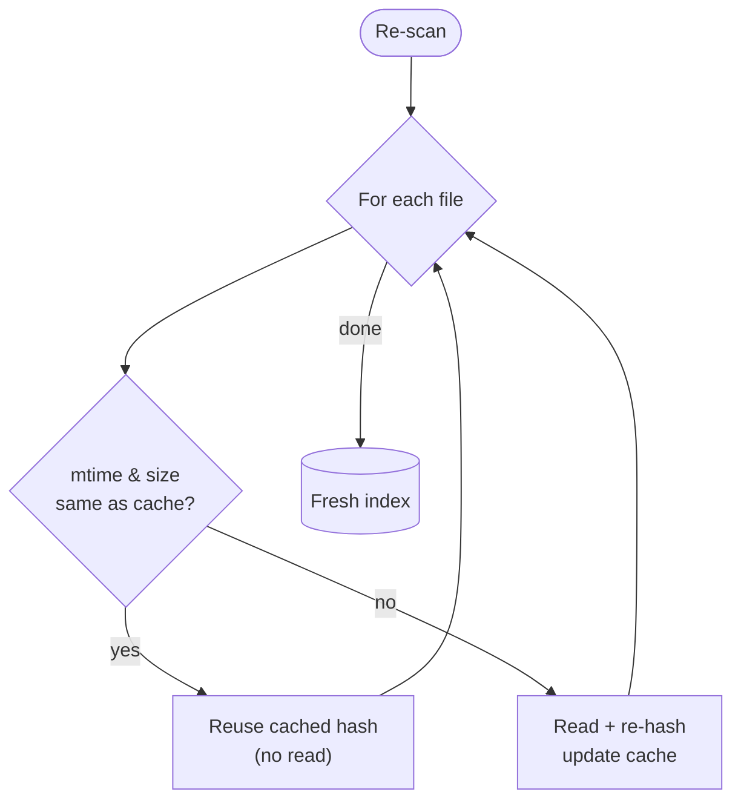

# Scanning & the cache

The first time BMM sees your mods folder it builds an **index**: for every file, a path, a size,
a modification time, and a content hash. Everything else — conflict detection, integrity,
"what changed?" — reads that index instead of the disk.

## The problem with re-scanning

Hashing gigabytes on every launch would be slow and pointless: almost nothing changes between two
runs. So a re-scan is **incremental**. BMM trusts the filesystem's modification time (`mtime`) and
size as a cheap "did this change?" check, and only re-hashes files that fail it.

On a warm cache a re-scan reads metadata only — thousands of files in a blink — and spends real
I/O solely on what actually moved.

## Why keep a hash at all, if mtime is enough?

`mtime` answers *"might this have changed?"*. The hash answers *"is this the exact file I expect?"*.
The first is a fast filter; the second is the truth. BMM uses the fast filter to decide *when* to
compute the truth. The hash is what powers integrity checks and lets a server repo say "your copy
matches mine" without sending the file.

## What a scan never does

A scan is strictly read-only. It builds knowledge; it never modifies, moves, or deletes a mod.
Unrecognised files are listed for you to name or [map](mapper.md), not touched.

!!! info "See it in the app"
    Help &amp; other → Developer → **mtime cache** and **Mod sync**; the **Scan** tutorial.
