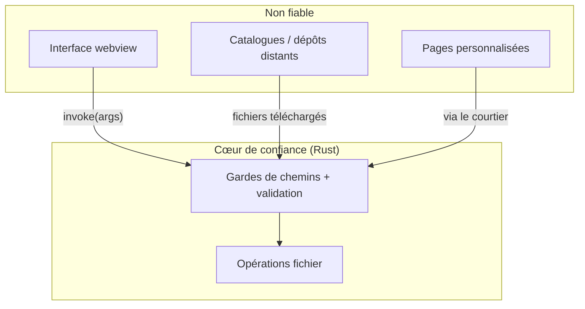
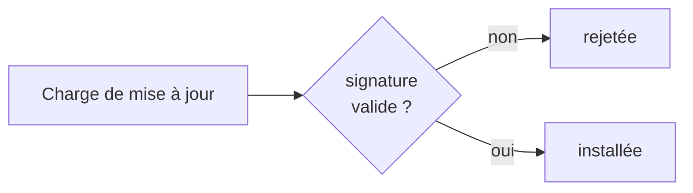

# Modèle de sécurité

BMM tourne sur votre machine, avec vos fichiers, et peut atteindre le réseau. Cela impose des
frontières de confiance claires. En résumé : **considérer l'interface et le contenu distant comme non
fiables, vérifier au cœur, et ne jamais exécuter ce qui n'est pas signé ou confiné.**

## Frontières de confiance

Chaque requête qui franchit la frontière vers le cœur y est validée — l'interface n'est jamais crue sur
parole.

## Les gardes concrets

- **Traversée de chemin** — les opérations fichier rejettent `..`, les chemins absolus et les
  échappements par lettre de lecteur, et sont confinées au dossier qu'elles doivent toucher (un replay
  ne se supprime que depuis le dossier Replays, une archive ne s'extrait que dans sa cible). Une
  archive malveillante ne peut pas écrire hors de son mod.
- **Intégrité avant exécution** — les fichiers téléchargés sont [vérifiés par hachage](integrity-hashing.md)
  avant d'être déployés ; un fichier corrompu ou substitué est bloqué.
- **Mises à jour signées** — les mises à jour de l'app et des paquets sont signées
  cryptographiquement et vérifiées avant installation, donc un homme du milieu ne peut pas pousser une
  charge même s'il intercepte la requête.
- **Extensions confinées** — les pages personnalisées n'atteignent BMM qu'à travers le courtier de
  permissions ; le serveur MCP parle via stdio, pas un port ouvert ; l'API locale écoute sur localhost.
- **Moindre privilège sur les jetons** — un PAT GitHub n'a besoin que d'une portée en lecture ; il est
  stocké localement et ne quitte jamais votre machine.

Rien de tout cela ne vous demande de faire confiance au réseau. Le réseau ne peut jamais que remettre
des octets à BMM ; c'est le cœur qui décide si ces octets ont le droit de devenir des fichiers sur
votre disque, selon des règles qui ne bougent pas.

!!! info "À voir dans l'app"
    Aide &amp; autre → Développeur → **Modèle de sécurité** et **Rapports de plantage**.
