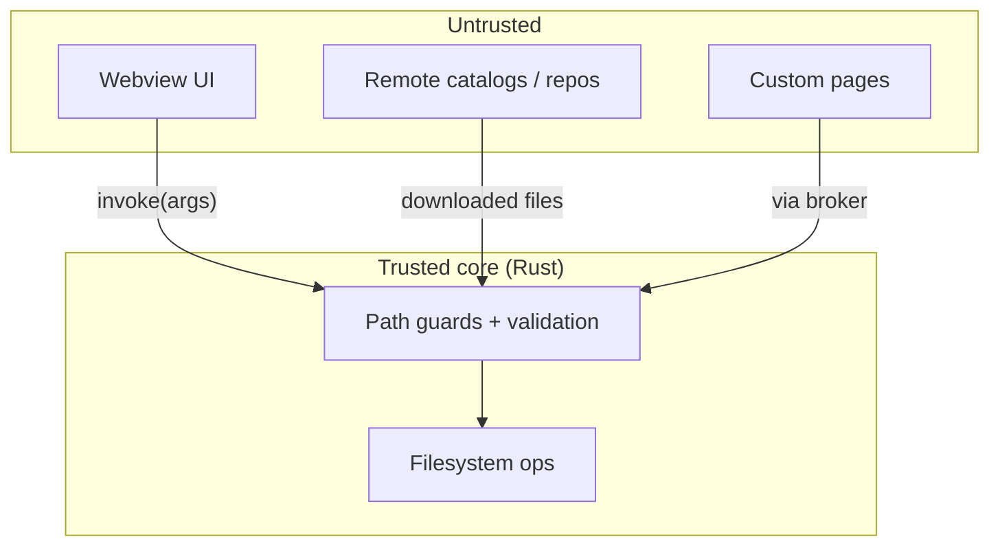
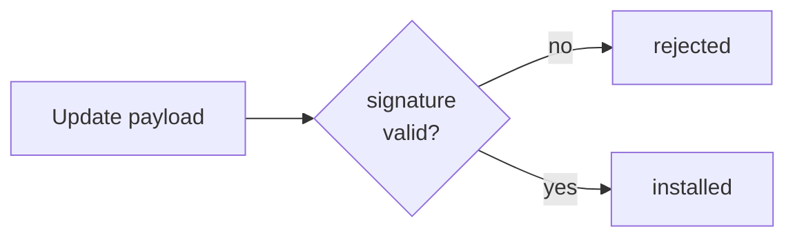

# Security model

BMM runs on your machine, with your files, and can reach the network. That earns it a clear set of
trust boundaries. The short version: **treat the UI and remote content as untrusted, verify at the
core, and never run anything that isn't signed or confined.**

## Trust boundaries

Every request that crosses into the core is validated there — the UI is never trusted to have done
the check.

## The concrete guards

- **Path traversal** — file operations reject `..`, absolute paths and drive-letter escapes, and
  are confined to the folder they're meant to touch (a replay can only be deleted from the Replays
  folder, an archive can only extract inside its target). A malicious archive can't write outside
  its mod.
- **Integrity before execution** — downloaded files are [hash-verified](integrity-hashing.md) before
  they're deployed; a corrupted or swapped file is blocked.
- **Signed updates** — app and package updates are cryptographically signed and checked before they
  install, so a man-in-the-middle can't push a payload even if they intercept the fetch.
- **Confined extensions** — custom pages reach BMM only through the permission broker; the MCP server
  speaks over stdio, not an open port; the local API binds to localhost.
- **Least privilege on tokens** — a GitHub PAT only needs read scope; it's stored locally and never
  leaves your machine.

None of this asks you to trust the network. The network can only ever hand BMM bytes; whether those
bytes are allowed to become files on your disk is decided by the core, against rules that don't move.

!!! info "See it in the app"
    Help &amp; other → Developer → **Security model** and **Crash reporting**.
