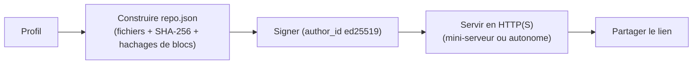
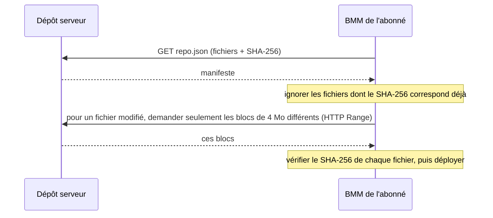

# Hébergement & synchro (dépôts serveur)

Un dépôt serveur transforme le profil d'une personne en **source de vérité hébergée** : tous les
abonnés convergent vers exactement les mêmes mods, versions et ordre — et le restent à mesure que le
propriétaire met à jour. Deux moitiés : l'héberger, et s'y synchroniser.

## Hébergement

BMM transforme le profil choisi en un dépôt servable :

- Un **manifeste** (`repo.json`) listant chaque fichier avec son hachage **SHA-256**, plus des
  **hachages de blocs de 4&nbsp;Mo** (SHA-256 aussi) pour des mises à jour différentielles.
- Une **signature** cryptographique : le manifeste est signé avec une clé **ed25519** dérivée de
  l'identité de l'hôte, et la clé publique est l'`author_id` du dépôt. Un abonné peut vérifier la
  signature pour confirmer que le dépôt vient bien de cet auteur.

Vous le servez soit depuis le **mini-serveur intégré** de BMM, soit via un serveur autonome généré
(Node, ou un script `.bat`/`.sh`) sur une machine dédiée, en HTTP — **le HTTPS est fortement
recommandé**.

### Contrôle d'accès (auto-hébergé)

Un dépôt auto-hébergé est **public par défaut**. Il peut être restreint de deux façons :

- Une **liste blanche / liste de bannis**, comparée automatiquement au compte lié ou à l'identité
  d'appareil d'un abonné.
- Un **mot de passe de téléchargement** optionnel. Définissez-le à la génération du serveur ; les
  abonnés se le voient alors demander à la première connexion (BMM l'envoie dans un en-tête
  `X-Repo-Password` et le retient pour les synchros suivantes). Laissez-le vide pour un dépôt ouvert.

Ne confondez pas ce mot de passe de téléchargement avec l'`admin_password` : ce dernier ne protège
que le panneau d'admin de l'*hôte* (pousser de nouvelles versions) et n'est pas une barrière pour les
abonnés.

## Synchro

Le client ne re-télécharge jamais à l'aveugle. Il récupère le manifeste et le réconcilie avec ce
qu'il possède.

Une **chaîne de version** sur le dépôt pilote la *détection* des mises à jour : BMM signale un mod
quand la version publiée du dépôt diffère de celle installée. Appliquer la mise à jour relance la
synchro ci-dessus — en ne transférant que les fichiers modifiés (jusqu'aux blocs modifiés) et en
retirant les mods que l'hôte a supprimés. D'où le coût de quelques Mo pour une petite mise à jour
d'une énorme collection.

!!! note "BetterCommunity, ce n'est pas la même chose"
    Le hub BetterCommunity ajoute des fonctions qu'un dépôt que vous hébergez vous-même n'a **pas** :
    une empreinte `BCR-XXXX-XXXX`, un accès par compte (e-mail / mot de passe), et de l'hébergement
    géré. Un dépôt auto-hébergé a la signature `author_id` ci-dessus — pas une empreinte BCR.

!!! info "À voir dans l'app"
    Aide &amp; autre → Développeur → **Mode serveur** et **Flux d'hébergement**. Guide utilisateur :
    [Dépôt Serveur](../features/repo.md).
