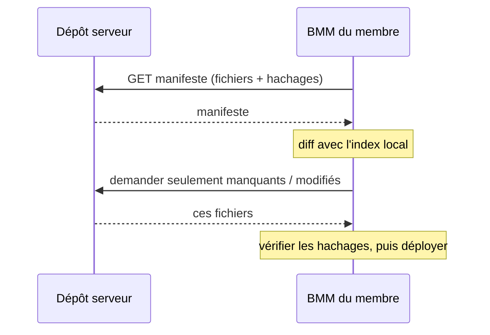
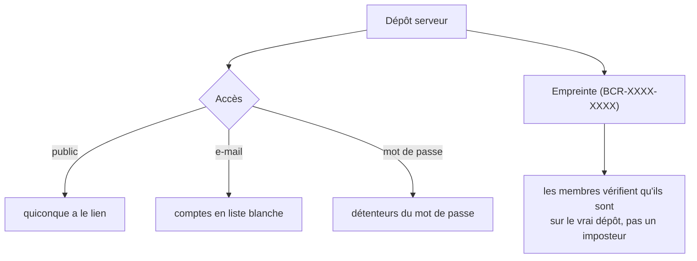

# Synchro & dépôts serveur

Un dépôt serveur transforme le profil d'une personne en **source de vérité hébergée**. Tous les
abonnés convergent vers exactement les mêmes mods, versions et ordre — et le restent à mesure que le
propriétaire le met à jour.

## Comment un client reste synchronisé

Le client ne re-télécharge jamais à l'aveugle. Il récupère le **manifeste** du dépôt — une liste de
fichiers avec leurs empreintes BLAKE3 — et la compare à ce qu'il possède déjà. Seules les différences
bougent.

Voilà pourquoi une petite mise à jour d'une collection de 10&nbsp;Go coûte quelques Mo : le diff du
manifeste isole le seul mod modifié, et le hachage d'intégrité garantit que les octets transférés sont
corrects.

## Accès & authenticité

Un dépôt peut être ouvert, ou protégé par e-mail/mot de passe, et chacun porte une **empreinte** stable
pour que les membres confirment qu'ils sont abonnés à la source authentique.

!!! info "À voir dans l'app"
    Aide &amp; autre → Développeur → **Mode serveur**, **Flux d'hébergement** et **Hébergement dédié**.
    Guide utilisateur : [Dépôt Serveur](../features/repo.md).
