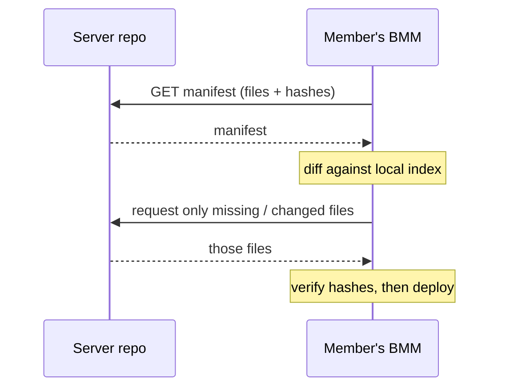
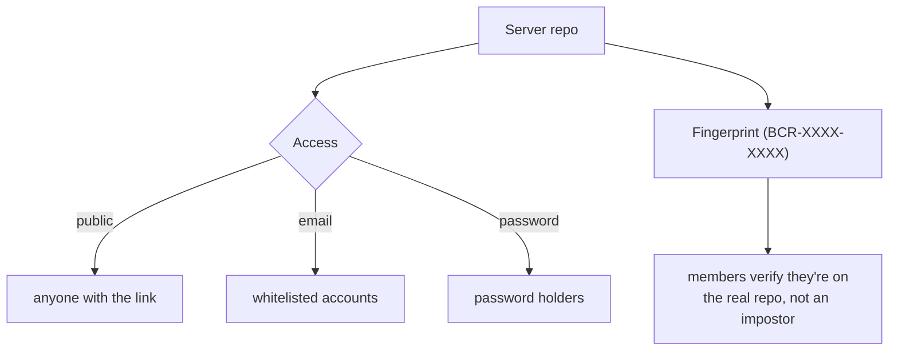

# Sync & server repos

A server repo turns one person's profile into a **hosted source of truth**. Everyone who subscribes
converges on the exact same mods, versions and order — and stays converged as the owner updates it.

## How a client stays in sync

The client never blindly re-downloads. It fetches the repo's **manifest** — a list of files with
their BLAKE3 fingerprints — and compares it to what it already has. Only the differences move.

That's why a small update to a 10&nbsp;GB collection costs a few MB: the manifest diff isolates the
one changed mod, and integrity hashing guarantees the transferred bytes are correct.

## Access & authenticity

A repo can be open, or gated by email/password, and each carries a stable **fingerprint** so
members can confirm they're subscribed to the genuine source.

!!! info "See it in the app"
    Help &amp; other → Developer → **Server mode**, **Hosting flow** and **Dedicated hosting**.
    User guide: [Server Repo](../features/repo.md).
